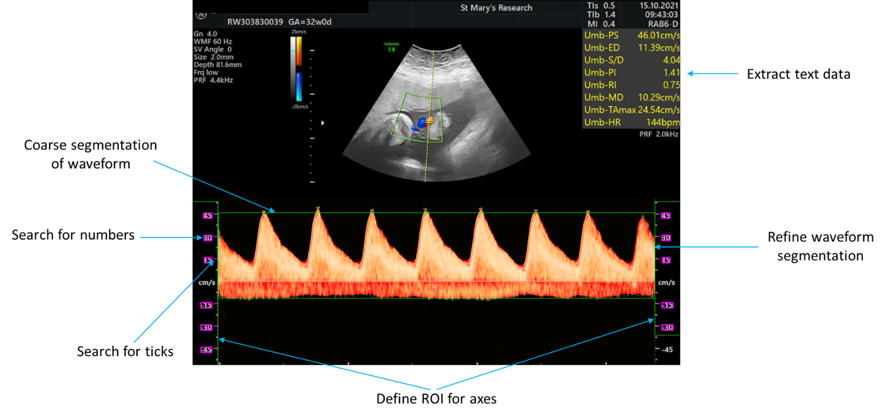

.. _details:
Details
=======
.. contents::
   :depth: 3
..

|image1|\ |A screenshot of a ultrasound Description automatically
generated|\ **Ultrasound segmentation package**

At a high level, the primary components of the segmentation can be seen
on the illustration below:

LetÔÇÖs start by looking at the code **single_image_processing**, which
calls functions in this order:

-  Colour_extract_vectorized

-  Text_from_greyscale

-  Initial_segmentation

-  Search_for \_ticks

-  Search_for_labels

-  Segment_refinement

-  Plot_Digitized_data

-  Plot_correction

Each of these performs a particular transformation of the input data,
which I will give a brief description of, then cover the layers or
refinement to ensure the code is as robust as possible.

**Colour_extract_vectorized**

From the plot, it is apparent nearly half of the initial entries to the
database are in fact duplicates of existing entries ÔÇô these are
identified by looking for entries with non-unique values for Patient Id,
date of exam, PS, ED, HR and PI.

From there, if we are interested in the gestational age of the entries,
around a third are either missing or have a mistaken gestation age
value. We can try and resolve this by identifying patients that do have
gestational age associated with at least one entry and calculate the
gestational age of those other entries based on this, knowing that every
entry must have a date of exam present.

In the final stages of refinement, we search for only those entries
which have a complete set of non-zero values of PS, ED, and HR, then
filter these entries by imposing the physiologically realistic bound on
each of the aforementioned metrics. Both of these steps lose around 15%
of the remaining.

The illustration above gives a scaled representation of these losses,
and should allow discussion around what improvements can be made based
on the potential gain in final number of cases.

This diagram starts at the point where the database has been created,
but there may be more potential gains upstream of this. For instance,
how many of the initial list of likely ultrasound scans have made it to
the database, and above that, since we are only segmenting a particular
type of ultrasound machine, how many files exist of the SIEMENS scanner?

How many likely us images? ÔÇô 18.6k

.. |image1| image:: Overview1.png
   :width: 7.59306in
   :height: 3.55069in

