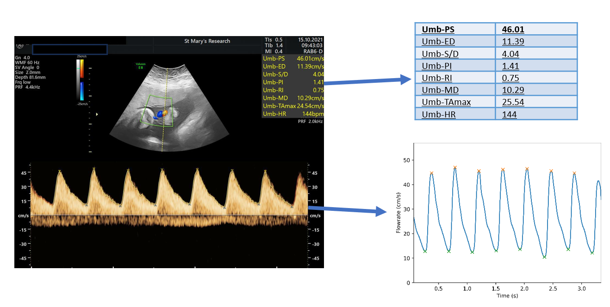
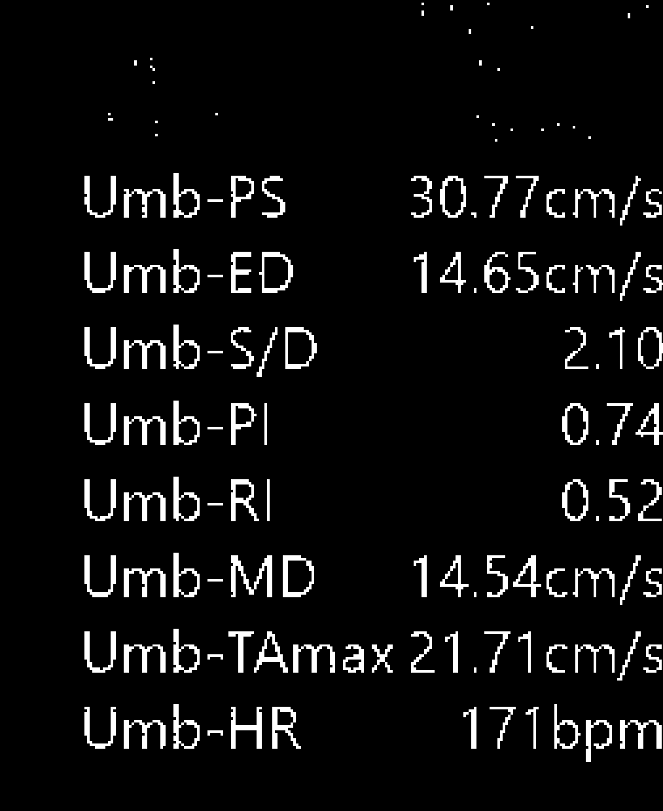
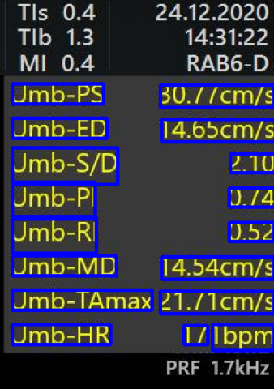
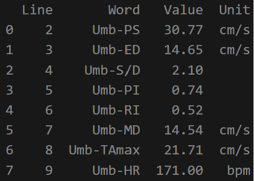
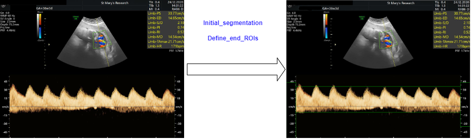
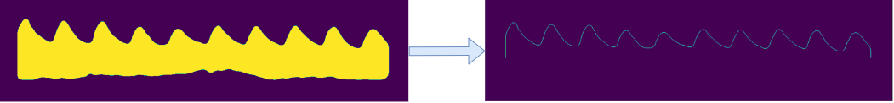
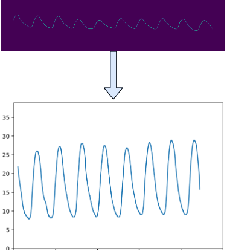
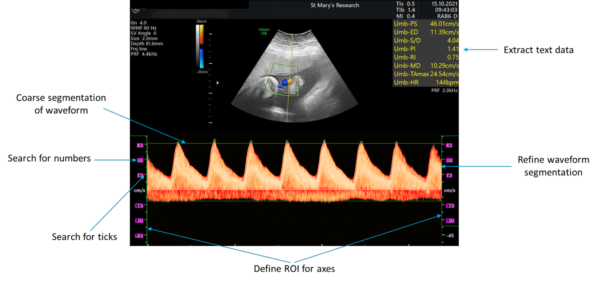
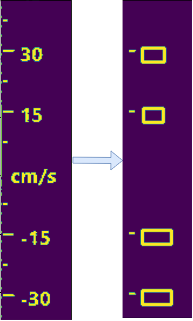
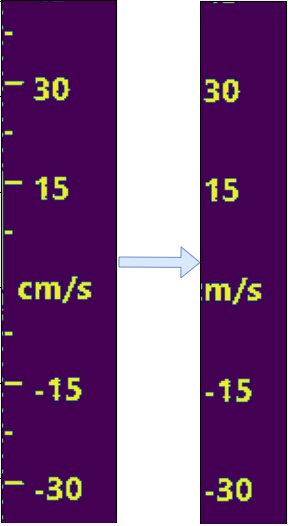

Information
=====================

These codes make up the framework for segmenting the doppler ultrasound
scans.

Table of Contents
-----------------

-  `Introduction to Ultrasound Segmentation Package (usseg) <#introduction>`__

-  `Overview <#overview>`__

-  `Usage examples <#usage>`__

-  `Limitations <#limitations>`__

~~~~~~~~~~~~~~~~~~~~~~~

.. _introduction:
Introduction to Ultrasound Segmentation Package (usseg)
=======================================================

This documentation introduces the Ultrasound Segmentation Package (usseg),
a specialized toolkit for extracting and processing data from Doppler
ultrasound images. Developed with a focus on compatibility with
the Voluson E8 ultrasound system.

The package is composed of a series of interconnected functions, each 
designed as a step in the sequential process of ultrasound image 
segmentation and analysis. While it offers particular advantages for 
users of the Voluson E8, there is scope to adapt these tools for use with 
other ultrasound systems.

The purpose of this documentation is to provide an overview of the
package, offering insights into:

- The mechanism and workflow for processing images.
- The functionalities and applications of each tool within the package.
- Example usage for a series of situations, such as single image processing,
  batch processing, and developer related cases.

For detailed information about individual functions, please refer to the
respective sections linked :doc:`here <usseg>`. This package, being open-source, is part
of a collaborative effort to advance ultrasound imaging technology, and we
welcome contributions and suggestions from the community.

.. _overview:
Overview
========

The Ultrasound Segmentation Package facilitates two primary blocks of functionality: 
text extraction from images and ultrasound image segmentation. Each block consists 
of a sequence of functions designed to work independently yet contribute collectively 
to the overall process.

Text Extraction Process
-----------------------

1. **colour_extract_vectorized**: Filters the image to highlight a specific target 
   colour of pixel, preparing it for text extraction.

2. **Text_from_greyscale**: Processes the filtered image to extract text, matching 
   lines to specific target words.

3. **Metric_check**: Performs a common-sense check on the extracted measurements 
   using knowledge of their interdependencies and known physiological limits, 
   ensuring data accuracy.

Following the successful extraction and validation of text data, the workflow 
transitions to the image segmentation process.

Image Segmentation Process
--------------------------

4. **Initial_segmentation**: Begins with a coarse segmentation of the waveform.
   
5. **Define_end_ROIs**: Defines regions adjacent to the coarse segmentation.

6. **Segment_refinement**: Refines the segmentation within the coarse boundaries.

7. **Search_for_ticks**: Identifies ticks in the axes ROIs for accurate scaling.

8. **Search_for_labels**: Locates labels within the axes ROIs for data extraction.
   
   |Search for Ticks| |Search for Labels|

9. **Plot_Digitized_data**: Digitizes the extracted data to plot the waveform.

10. **Plot_correction**: (Optional) Adjusts the time axis based on heart rate data.

11. **Annotate**: Visualizes the segmentation steps on the original image.

Each function in these sequences plays a vital role in the overall process, which aims for 
accurate data extraction. For more in-depth information about each function, please refer 
to the detailed descriptions in the :doc:`here <usseg>` section of this documentation.

.. _usage:
Usage Examples
==============

Some common usage examples include segmenting a single image, or processing a batch of images.

Processing a single image
-------------------------
For processing a single image, the data_from_image function is imported and provided with 
PIL and cv2 versions of the image. This could be done through the following code:

.. code-block:: python

   # Module imports
   import numpy as np
   from PIL import Image

   # Local imports
   from usseg import data_from_image

   img_path = "Path/to/a/ultrasound/image.JPG"

   PIL_image = Image.open(img_path)
   cv2_image = np.array(PIL_image)
   df, (xdata, ydata) = data_from_image(PIL_image, cv2_image)

Alternatively, the single image processing script within the tests folder can be modified for 
any given input image.

Batch processing images
-----------------------
For processing groups of images, the usseg.main module can be used. This module is designed 
to process a series of images contained in a folder and save to specified location, defined in the config.toml. 
A visualisation file output.html is generated for evaluation the data extraction. This can be done through:

.. code-block:: python

   python usseg/main.py

.. _limitations:
Limitations and future work
===========================

Work on this data extraction package is ongoing. Testing and development
have highlighted several limitations and areas for improvement, guiding
the next steps in its evolution.

The package is currently designed for scans typical of the Voluson E8.
This typically includes measurements in the upper right corner in yellow
and the Doppler waveform in the center bottom half, including both left
and right y-axes. While the functions leverage these features to ensure
accuracy, a limitation is their ineffectiveness with scans from different
types of machines. However, the framework is robust, and minor
modifications could adapt it for other ultrasound devices.

Regarding data extraction, there are occasions where text data is not
correctly extracted. Errors might include missing decimal points or
misinterpretation of characters (e.g., '5' read as an 'S'). Common-sense
checks help mitigate these errors, but they are not foolproof.

Waveform segmentation and digitization quality often depend on the
image's contrast. Faint waveforms against the black background might
result in inaccurate segmentation or complete failure to identify.
Furthermore, some scans are inverted, and although there are measures
to adjust these during digitization, exceptions can still occur.

